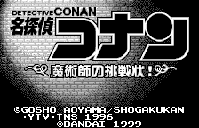
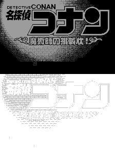

# 需要汉化的图片

**`0AE197_merged.png`**

# 背景信息
上图由 **`0AE197.png`** 处理得到。

其中上半部分是位于底部的图层，下半部分是位于顶部的图层。

WonderSwan 的单个图层每个 tile 最多可以使用 4 种颜色。顶部图层可以使用透明色，使得底部的图层可以显示出来，但会占用颜色数量，所以事实上 2 个图层总共最多只能使用 7 种不同的颜色（底部4 + 顶部3）。

# 颜色限制
保险起见，最好使用游戏原调色盘。

其中，底部图层使用的灰度为：

顶部图层使用的灰度为:

可以在同路径下获取调色盘图片`pal0_9C-42-73-00.png`、`pal5_9C-DE-BD-FF.png`。
