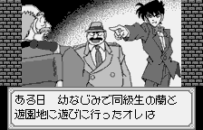
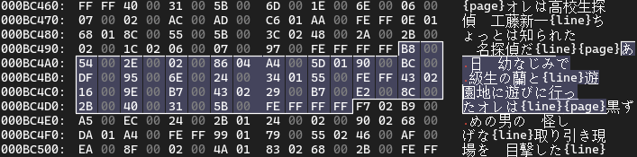

> [!note]
下面以游戏最初的文本为例，说明相应**游戏画面**、**二进制内容**和**工程文件**的关系。

<p align="center">
  
</p>
以上在游戏运行中显示的文本，经过基本的逆向工程，可在 ROM 中找到对应的二进制数据。
<p align="center">
  
</p>

```
Hex View  00 01 02 03 04 05 06 07  08 09 0A 0B 0C 0D 0E 0F
 
000BC490                                             B8 00                ..
000BC4A0  54 00 2E 00 02 00 86 04  A4 00 5D 01 90 00 BC 00  T.........].....
000BC4B0  DF 00 95 00 6E 00 24 00  34 01 55 00 FE FF 43 02  ....n.$.4.U...C.
000BC4C0  16 00 9E 00 B7 00 43 02  29 00 B7 00 E2 00 8C 00  ......C.).......
000BC4D0  2B 00 40 00 31 00 5B 00  FE FF FF FF              +.@.1.[.....
```
本游戏的原编码很简单，每个字符都是用2个字节编码。控制码有`FE FF`和`FF FF`，本工程分别用`{line}`、`{page}`标记，前者*指示文本换行*，后者*终止当前文本的解码和输出*。

这样**一段文本**对应着**一个指针**，工程文件内也以指针为单位组织文本。
```ini
……

String0x0BC462:
; .strn "オレは高校生探偵　工藤新一{line}ちょっとは知られた　名探偵だ{line}{page}"
  .strn "我是工藤新一{line}是小有名气的高中生侦探{line}{page}"

String0x0BC49E:
; .strn "ある日　幼なじみで同級生の蘭と{line}遊園地に遊びに行ったオレは{line}{page}"
  .strn "某一天跟青梅竹马的同学毛利兰{line}到游乐园玩的时候{line}{page}"

String0x0BC4DC:
; .strn "黒ずくめの男の　怪しげな{line}取り引き現場を　目撃した{line}{page}"
  .strn "不经意间目击到了{line}黑衣人的交易{line}{page}"

……
```

译文受到的约束主要从“存储”和“运行”两个方面去分析：

### ▶️运行

即译文在游戏运行中面临的限制。

仍以上面的文本为例，可见两行文本几乎要填满对话框了。第二行还能加几个字，第一行看似能加1个字，但实际需要测试一下，以防出现预期外的 bug 。所以即使 ROM 支持存储更多文本，有时候对话框也放不下。当然，去调整对话框大小或者文本显示逻辑（如滚动更新）也是可能的，只不过实在没必要花费额外的精力去冒这种险。


### 💾存储

  即译文被重新编码并存储在 ROM 二进制中受到的限制。
  
  多数文本前后相接，存储在连续区域，并且与其他数据相接，是比较常见的情况。最保守的策略，是每一段译文仍然只存储于原来的区域。在指针被探明的情况下，文本存储的位置和方式可以更加灵活。
